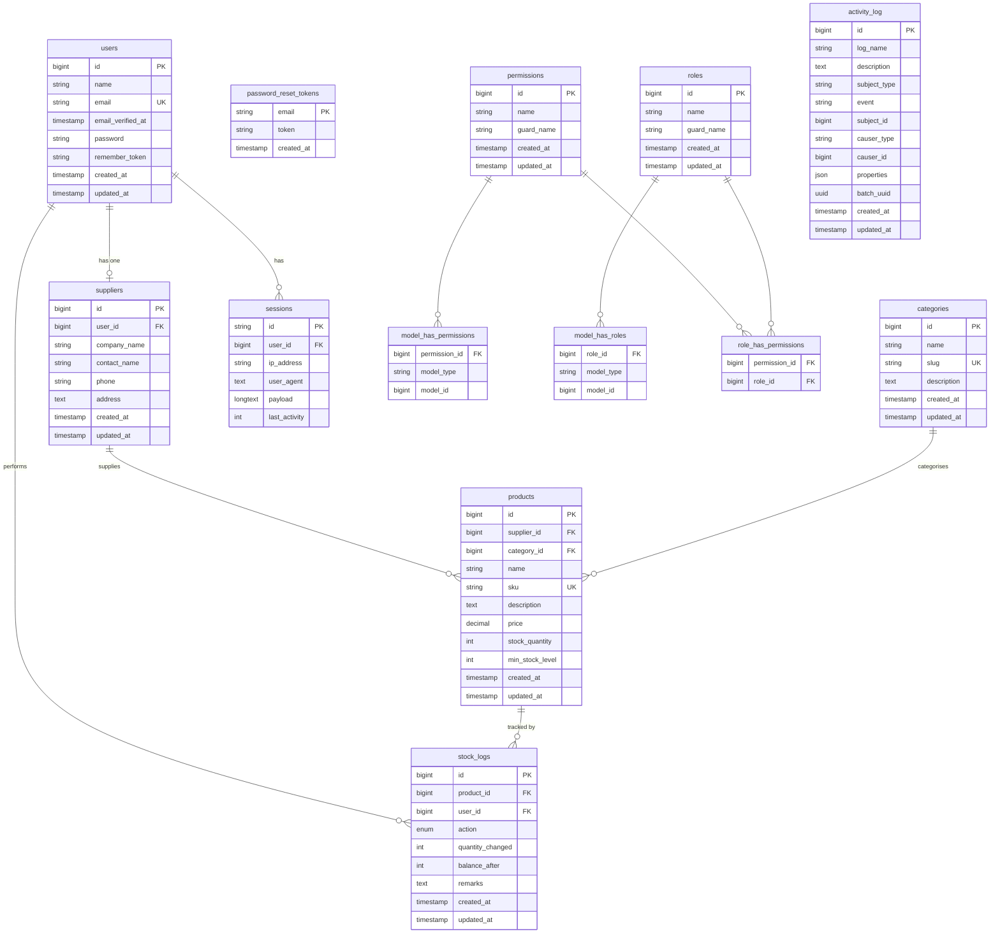

# Database Schema

## Entity Relationship Diagram

---

## Table Reference

### `users`
Stores all application users (admins and suppliers share this table; role is determined by Spatie roles).

| Column | Type | Notes |
|---|---|---|
| id | bigint | PK |
| name | string | |
| email | string | unique |
| email_verified_at | timestamp | nullable |
| password | string | hashed |
| remember_token | string | nullable |
| created_at / updated_at | timestamp | |

---

### `suppliers`
One-to-one extension of `users` for supplier-specific profile data. A supplier user must have a matching row here to access the supplier panel (Filament tenancy).

| Column | Type | Notes |
|---|---|---|
| id | bigint | PK |
| user_id | bigint | FK → users, cascade delete |
| company_name | string | |
| contact_name | string | |
| phone | string | nullable |
| address | text | nullable |
| created_at / updated_at | timestamp | |

---

### `categories`
Product categories.

| Column | Type | Notes |
|---|---|---|
| id | bigint | PK |
| name | string | |
| slug | string | unique |
| description | text | nullable |
| created_at / updated_at | timestamp | |

---

### `products`
Core inventory item. `stock_quantity` is managed exclusively by `StockService` — it is intentionally excluded from the model's `$fillable` array to prevent direct mass-assignment.

| Column | Type | Notes |
|---|---|---|
| id | bigint | PK |
| supplier_id | bigint | FK → suppliers, cascade delete |
| category_id | bigint | FK → categories, cascade delete |
| name | string | |
| sku | string | unique |
| description | text | nullable |
| price | decimal(10,2) | |
| stock_quantity | int | default 0, managed by StockService |
| min_stock_level | int | default 10, triggers LowStockDetected event |
| created_at / updated_at | timestamp | |

---

### `stock_logs`
Immutable audit trail of every stock movement. Every call to `StockService::restock()`, `deduct()`, or `adjust()` writes one row.

| Column | Type | Notes |
|---|---|---|
| id | bigint | PK |
| product_id | bigint | FK → products, cascade delete |
| user_id | bigint | FK → users, cascade delete |
| action | enum | `restock`, `deduction`, `adjustment` |
| quantity_changed | int | negative for deductions |
| balance_after | int | stock_quantity after the operation |
| remarks | text | nullable |
| created_at / updated_at | timestamp | |

---

### `permissions` / `roles` / `model_has_permissions` / `model_has_roles` / `role_has_permissions`
Managed by [spatie/laravel-permission](https://github.com/spatie/laravel-permission). Provides role-based access control for the admin and supplier panels.

---

### `activity_log`
Managed by [spatie/laravel-activitylog](https://github.com/spatie/laravel-activitylog). Records model changes (create/update/delete) on `Product`, `Category`, and `Supplier` models via the `LogsActivity` trait. Uses a polymorphic `subject` relation.

| Column | Type | Notes |
|---|---|---|
| id | bigint | PK |
| log_name | string | nullable |
| description | text | |
| subject_type / subject_id | polymorphic | the model that changed |
| event | string | nullable (create, update, delete) |
| causer_type / causer_id | polymorphic | the user who made the change |
| properties | json | old/new attribute values |
| batch_uuid | uuid | nullable, groups related log entries |
| created_at / updated_at | timestamp | |

---

### Infrastructure tables
| Table | Purpose |
|---|---|
| `password_reset_tokens` | Laravel password reset flow |
| `sessions` | Database-backed session storage |
| `cache` | Laravel cache driver |
| `jobs` | Laravel queue job storage |
